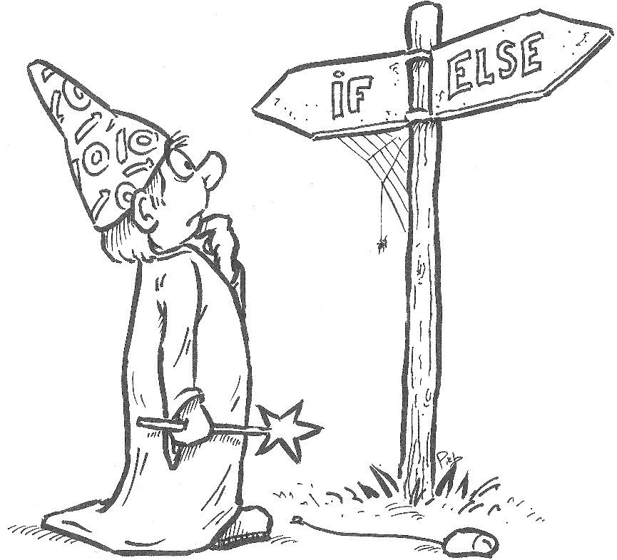

Conditional statements are, as the introduction to this chapter said,
statements consisting of a test and one or more actions, whereby the
actions only get executed if the test evaluates to `True`. Conditional
statements are also called "if-statements," as they are written using
the special keyword `if`.

Here is an example:

```python
    x = 5
    if x == 5:
        print( "x equals 5" )
```

The syntax of the `if` statement is as follows:

```python
if <boolean expression>:
    <statements>
```

Note the colon (:) after the boolean expression, and the fact that
`<statements>` is indented.

### Code blocks

In the syntactic description of the `if` statement above, you see that
the `<statements>` are "indented," i.e., they are placed one tabulation
to the right. This is intentional and necessary. Python considers
statements that are following each other and that are at the same level
of indentation part of a code block. The code block underneath the first
line of the `if` statement is considered to be the list of actions that
are executed when the boolean expression evaluates to `True`. For
example:

```python
x = 7
if x < 10:
    print( "This line is only executed if x < 10." )
    print( "And the same holds for this line." )
print( "This line, however, is always executed." )
```

Change the value of `x` to see how it affects the outcome of the code.

Thus, all the statements under the `if` that are indented, belong to the
code block that is executed when the boolean expression of the `if`
statement evaluates to `True`. This code block is skipped if the boolean
expression evaluates to `False`. Statements which follow the `if`
construction which are not indented (as deep as the code block under the
`if`), are executed, regardless of whether the boolean expression
evaluates to `True` or `False`.

Naturally, you are not restricted to having just a single if statement
in your code. You can have as many as you like.

```python
x = 5
if x == 5: 
    print( "x equals 5" )
if x > 4: 
    print( "x is greater than 4" )
if  x >= 5:
    print( "x is greater than or equal to 5" )
if x < 6: 
    print( "x is less than 6" ) 
if x <= 5:
    print( "x is less than or equal to 5" )
if x != 6 :
    print( "x does not equal 6" )
```

Again, try changing the value of `x` and see how it affects the outcome.

### Indentation

In Python, **correct indenting is of the utmost importance**! Without
correct indentation, Python will not be able to recognize which
statements belong together as one code block, and therefore cannot
execute your code correctly.[^1]

Note that you can indent using the `Tab` key, or indent using spaces.
Most editors will auto-indent for you, i.e., if, for instance, you write
the first line of an `if` statement, once you press `Enter` to go to the
next line, it will automatically "jump in" one level of indentation (if
it does not, it is very likely that you forgot the colon at the end of
the conditional expression). Also, when you have indented one line to a
certain level of indentation, the next line will use the same level. You
can get rid of indentations using the `Backspace` key.

For Python programs, a normal level of indentation is four spaces, i.e.,
one press of the `Tab` key should "jump in" four spaces. As long as you
are in one editor, you can in such a case either use the `Tab` key, or
press the spacebar four times, to go up one indentation level. So far so
good. You may get into problems, however, if you port your code to
another editor, which might have a different setting for the `Tab` key.
If you edit your code in a such a different editor, even though it might
look okay, Python may see that there are indentation conflicts (a mix of
tabulations and space-indentations) and may report a syntax error when
you try to run your code. Most editors therefore offer the option to
automatically replace tabulations with spaces, so that such problems do
not arise. If you use a text editor to write Python code, check if it
contains such an option, and if so, ensure that tabulations are set to 4
and are automatically replaced by spaces.

The following code contains multiple indentation errors. Fix them all.

```python
# This code contains indentation errors!
x = 3
y = 4
if x == 3 and y == 4:
    print( "x is 3" )
   print( "y is 4" )
if x > 2 and y < 5:
print( "x > 2" )
print( "y < 5" )
if x < 4 and y > 3:
    print( "x < 4" )
        print( "y > 3" )
```

### Two-way decisions

Often a decision branches, e.g., if a certain condition arises, you want
to take a particular action, but if it does not arise, you want to take
another action. This is supported by Python in the form of an expansion
to the `if` statement that adds an `else` branch.

```python
x = 4
if x > 2:
    print( "x is bigger than 2" )
else:
    print( "x is smaller than or equal to 2" ) 
```

The syntax is as follows:

```python
if <boolean expression>:
    <statements>
else:
    <statements>
```

Note the colon (:) after both the boolean expression and the `else`.

It is important that the word `else` is aligned with the word `if` that
it belongs to. If you do not align them correctly, this results in an
indentation error.

A consequence of adding an `else` branch to an `if` statement is that
always exactly one of the two code blocks will be executed. If the
boolean expression of the `if` statement evaluates to `True`, the code
block directly under the `if` will be executed, and the code block
directly under the `else` will be skipped. If it evaluates to `False`,
the code block directly under the `if` will be skipped, while the code
block directly under the `else` will be executed.

{:width="65%"}

You can test whether an integer is odd or even using the modulo
operator. Specifically, when `x % 2` equals zero, then `x` is even, else
it is odd. Write some code that asks for an integer and then reports
whether it is even or odd (you can use the `getInteger()` function from
`pcinput` to ask for an integer).

Note: As far as indentation is concerned, it is not absolutely necessary
to have the code block under the `else` branch use the same number of
spaces in indentation as the code block under the `if` branch, as long
as the indentation is consistent within the code block. However,
accomplished programmers use consistent indentation throughout their
programs, which makes it easier to see what the whole `if`-`else`
statement encompasses. For example, in the code below the indentation in
the `else` branch uses less spaces than the indentation in the `if`
branch. While syntactically correct, this makes the code less readable.

```python
# Example of syntactically correct but ugly indenting.
x = 1
if x > 2:
    print( "x is bigger than 2" )
else:
  print( "x is smaller than or equal to 2" )
```

### Flow charts

In the early days of programming, programmers often expressed the
algorithms they wanted to implement by means of so-called "flow charts."
Nowadays, flow charts are seldom used anymore. However, I found that it
often helps students understanding how exactly conditions (and, for the
next chapter, iterations) work if they are shown a flow chart of the
process.

A flow chart is a diagram that shows different kinds of blocks with
arrows in between. The blocks are of three kinds (at least, that is all
I need for this book). Rectangular blocks contain statements that are
executed. Diamond-shaped blocks contain a condition that evaluates to
either `True` or `False`. Rectangular blocks with rounded corners
indicate either the start (using the text "Start") or end (using the
text "Stop") of the algorithm.

To interpret a flow chart, you begin at the "Start" block, and follow
the arrows, executing all statements that you encounter. When you get to
a diamond-shaped block, you evaluate the condition in it, and then
either follow the arrow marked `True` in case it evaluates to `True`, or
the arrow marked `False` when it evaluates to `False`. When you
encounter the "Stop" block, you are finished.

For example, the code shown above, that checks if a number is greater
than 2 or smaller than or equal to 2, and prints some text that states
as much, is equivalent to the flow chart shown in Figure
<a href="#f:chart1" data-reference-type="ref" data-reference="f:chart1">7.1</a>.

{:width="60%" data-caption="Flow chart expressing a two-way decision."}

### Multi-branch decisions

Occasionally, you encounter multi-branch decisions, where one of
multiple blocks of commands has to be executed, but never more than one
block. Such multi-branch decisions can be implemented using a further
expansion of the `if` statement, namely in the form of one or more
`elif` statements (`elif` stands for "else if").

```python
age = 21
if age < 12:
    print( "You're still a child!" )
elif age < 18:
    print( "You are a teenager!" )
elif age < 30:
    print( "You're pretty young!" )
elif age < 50:
    print( "Wisening up, are we?" )
else:
    print( "Aren't the years weighing heavy?" )
```

This code is equivalent to the algorithm expressed by the flow chart in
Figure
<a href="#f:chart2" data-reference-type="ref" data-reference="f:chart2">7.3</a>.

{:width="60%" data-caption="Flow chart expressing a multi-branch decision."}

In the code block above, change age to different values and observe the
results.

The syntax is as follows:

```python
if <boolean expression>:
    <statements>
elif <boolean expression>:
    <statements>
else:
    <statements>
```

The syntax above shows only one `elif`, but you can have multiple. The
different tests in an `if`-`elif`-`else` construct are executed in
order. The first boolean expression that evaluates to `True` will cause
the code block that belongs to that expression to be executed. None of
the other code blocks of the construct will be executed.

So, first the boolean expression next to the `if` will be evaluated. If
it evaluates to `True`, the code block underneath the `if` will be
executed. Otherwise, the boolean expression for the first `elif` will be
evaluated. If that turns out to be `True`, the code block underneath it
will be executed. Otherwise, the boolean expression for the next `elif`
will be evaluated. Etcetera. Only when the boolean expressions for the
`if` and all of the `elif`s evaluate to `False`, the code block
underneath the `else` will be executed.

Therefore, in the code above, you do not need to test
`age >= 12 and age < 18` for the first `elif`. Just testing `age < 18`
suffices, because if age was smaller than $$12$$, already the boolean
expression for the `if` would have evaluated to `True`, and the boolean
expression for the first `elif` would not even have been encountered by
Python.

Note that the inclusion of the `else` branch is always optional.
However, in most cases where I need `elif`s I include it anyway, if only
for error checking.

Write a program that defines a variable `weight`. If `weight` is greater
than $$20$$ (kilo's), print: "There is a \$$25 surcharge for luggage that
is too heavy." If `weight` is smaller than $$20$$, print: "Have a safe
flight!" If `weight` is exactly $$20$$, print: "Pfew! The weight is just
right!" Make sure that you change the value of `weight` a couple of
times to check whether your code works.

### Nested conditions

Given the rules of the `if`-`elif`-`else` statements and identation, it
is perfectly possible to use an `if` statement within another `if`
statement. This second `if` statement is only executed if the condition
for the first `if` statement evaluates to `True`, as it belongs to the
code block of the first `if` statement. This is called "nesting."

```python
x = 41
if x%7 == 0:
    # --- Here starts a nested block of code ---
    if x%11 == 0:
        print( x, "is dividable by both 7 and 11." )
    else:
        print( x, "is dividable by 7, but not by 11." )
    # --- Here ends the nested block of code ---
elif x%11 == 0:
    print( x, "is dividable by 11, but not by 7." )
else:
    print( x, "is dividable by neither 7 nor 11." )
```

This code is equivalent to the algorithm expressed in Figure
<a href="#f:chart3" data-reference-type="ref" data-reference="f:chart3">7.4</a>.

Change the value of `x` and observe the results.

Note that the example above is just to illustrate nesting; you probably
already know different ways of getting the same results that are a bit
more readable. In particular, nesting of `if` statements can often be
avoided by judicious use of `elif`s. To give an example, here is a
"nested" example of the age code given above:

{:width="80%" data-caption="Flow chart expressing a nested condition."}

```python
age = 21
if age < 12:
    print( "You're still a child!" )
else:
    if age < 18:
        print( "You are a teenager!" )
    else:
        if age < 30:
            print( "You're pretty young!" )
        else:
            if age < 50:
                print( "Wisening up, are we?" )
            else:
                print( "Aren't the years weighing heavy?" )
```

I assume you agree that the version with the `elif`s looks better.

[^1]: In many programming languages (actually, in almost all programming
    languages), code blocks are recognized by having them start and end
    with a specific symbol or keyword. For instance, in languages such
    as Java and C++, code blocks are enclosed by curly brackets, while
    in languages such as Pascal and Modula, code blocks are started with
    the keyword `begin` and ended with the keyword `end`. That means
    that in almost all languages, indenting to recognize code blocks is
    not necessary. However, you will find that code written by capable
    programmers is always nicely indented, regardless of the language.
    This makes it easy to see which code belongs together, for instance,
    which commands belong to an `if` statement. Python makes indenting a
    requirement. While for experienced programmers who are new to Python
    this seems strange at first, they quickly find that they do not care
    – they were indenting nicely anyway, and Python's strategy makes
    that beginning programmers are also required to write nice-looking
    code.

