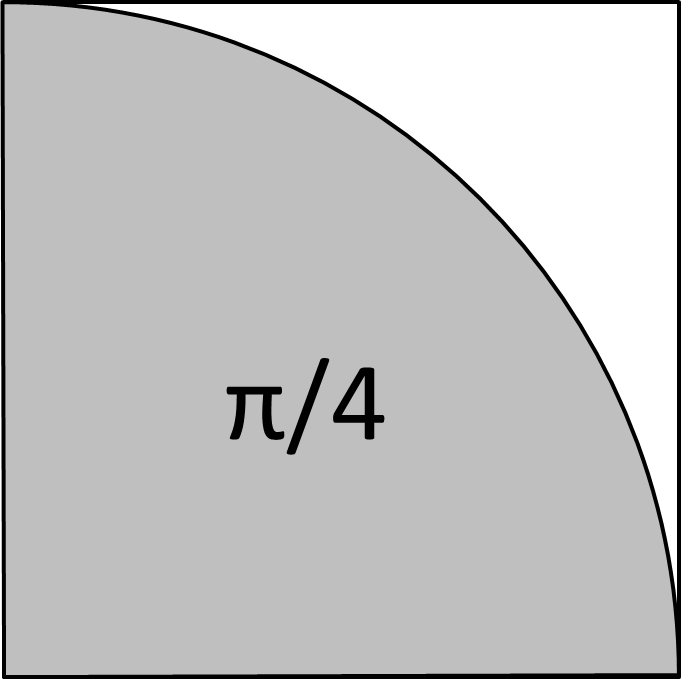

Schrijf een programma dat $\pi$ benadert door
middel van toevalsgetallen, als volgt: Neem een vierkant van 1 bij 1.
Als je een dart in dat vierkant gooit op een willekeurige plek, is de
waarschijnlijkheid dat de afstand van de dart tot de linkeronderhoek van
het vierkant kleiner dan 1 is gelijk aan $\pi/4$. Om dat in te zien,
bedenk dat de oppervlakte van een cirkel met straal 1 $\pi$ is, dus de
oppervlakte van een kwart cirkel is $\pi/4$. Als dus een dart op een
willekeurig punt in het vierkant landt, is de waarschijnlijkheid dat die
dart in de kwart cirkel landt $\pi/4$. Als je $N$ darts in het vierkant
werpt, en $M$ ervan landen in de kwart cirkel, dan benadert $4M/N$ de
waarde $\pi$ als $N$ voldoende groot is.

Het programma heeft een constante die aangeeft hoeveel darts gesimuleerd
moeten worden. Het toont een benadering van $\pi$ door het werpen van
zoveel darts te simuleren. De afstand van een punt $(x,y)$ tot de
linkeronderhoek kun je berekenen als $sqrt( x^2 + y^2 )$. Gebruik de
`random()` functie uit de `random` module.  

{:width="20%"}

### Invoer

Een numerieke score (percentage) voorgesteld als een natuurlijk getal $$s \in [0, 100]$$.

### Uitvoer

De letterscore die correspondeert met $$s$$.

### Voorbeeld

#### Invoer:

```
87
```

#### Uitvoer:

```
B
```
