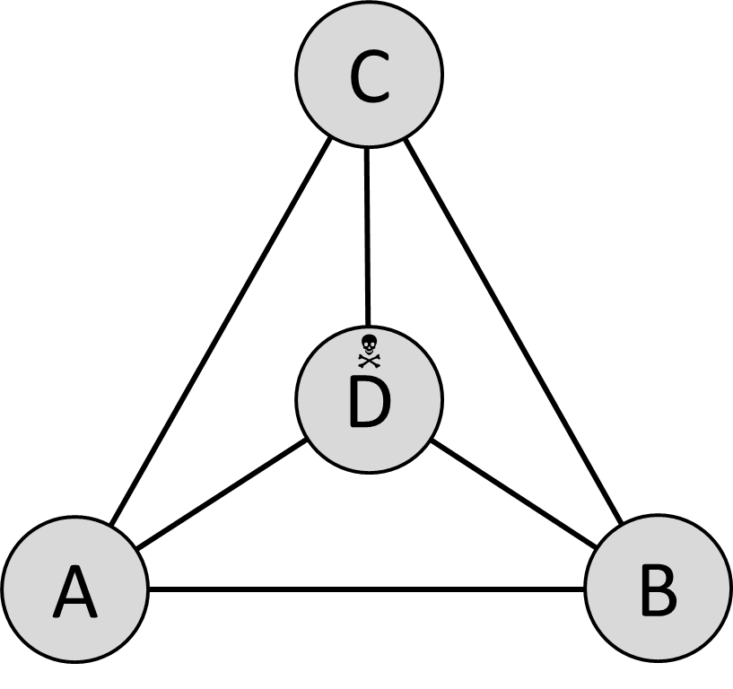

Consider the triangle shown below. This
triangle houses a colony of Triangle Crawlers, and one big Eater of
Triangle Crawlers. The Eater is located in point D. All Triangle
Crawlers are born in point A. A Triangle Crawler which ends up in point
D gets eaten.

{:width="30%"}

Every day, each Triangle Crawler moves over one of the lines to a
randomly-determined neighboring point, but not to the point where he was
the day before. This movement takes one day. For instance, a Triangle
Crawler that was just born in A, on the first day of his life will move
to B, C, or D. If he moves to B, the next day he will move to C or D
(but not back to A). If on his first day he moves to C instead, the next
day he will move to B or D (but not back to A). If he moves to D, he
gets eaten.

There is a one-third probability that Triangle Crawler on the first day
of his life immediately goes to D, and therefore only lives one day. In
principle, a Triangle Crawler may reach any age, however high, by moving
in circles from A to B to C and back to A again (or counterclockwise,
from A to C to B and back to A again). However, since every day he makes
a random choice between the two possible follow-up directions, every day
after the first there is a one-half probability that he ends up in point
D, and dies.

### Assignment

Calculate an approximation of the average age that
a Triangle Crawler reaches. Do this by simulating the lives of 100,000
Triangle Crawlers, counting the days that they live, and dividing the
total by 100,000.

{:class="callout callout-info"}
> #### Tip
> You can follow two different approaches: either you simulate the behavior of one single Triangle Crawler and repeat that 100,000 times, or you start with a population of 100,000 triangle crawlers in point A, and divide these over variables that keep track of how many Triangles are in each point, each day, including the point that they came from (assigning a remaining odd Triangle Crawler to a randomly determined neighboring point). The first method is short and simple but slow, the second is long and complex but fast. You may use either method.

{:class="callout callout-info"}
> #### Tip
> Do not use 100,000 Triangle Crawlers in your first attempts. Start with 1000 (or even only 1), and only try it out with 100,000 once your program is more or less finished. Testing is much quicker with fewer Triangle Crawlers. 1000 Triangle Crawlers should be done in under a second, so if your program takes longer, you probably have created an endless loop.

{:class="callout callout-info"}
> #### Tip
> I won't be too specific, but the final answer is somewhere between 1 and 5 days. If you get something outside that range, it is definitely wrong. You may try to determine the exact answer mathematically before starting on the exercise, which is doable though quite hard.    

### Input

No input.

### Output

The average age that a Triangle Crawler reaches, expressed as a single floating point number, rounded to two decimals.
