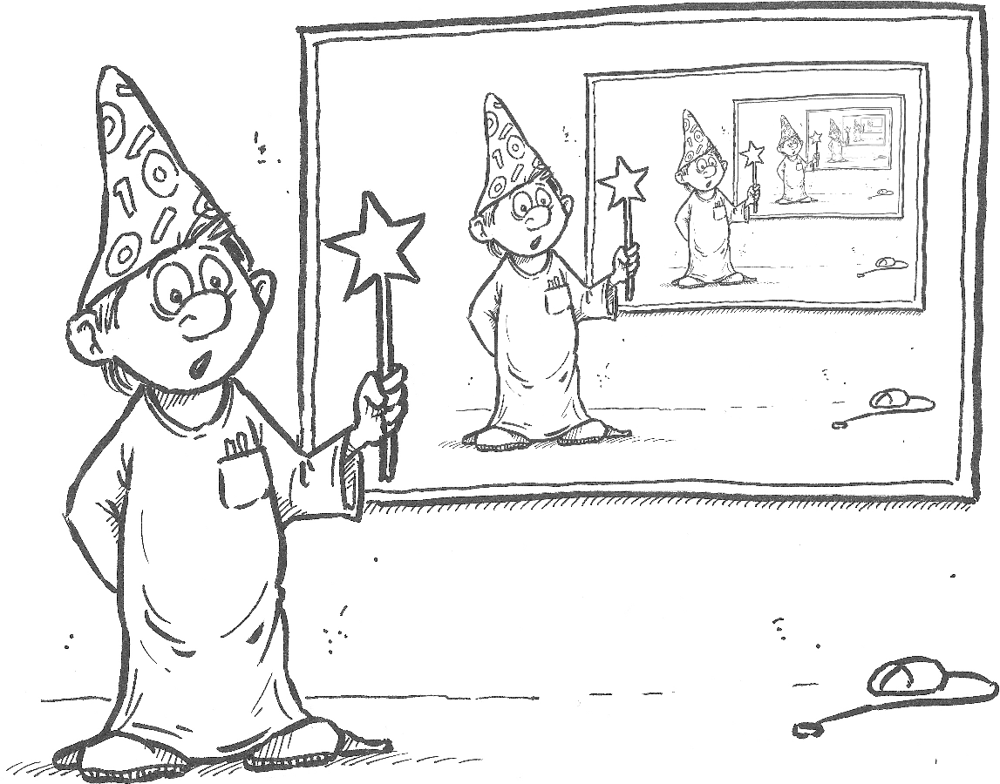

Recursie is een techniek waarbij een functie zichzelf aanroept. Iets
algemener gesteld, refereert het aan een situatie waarin een functie
andere functies aanroept op zo'n manier dat de uitvoering van de eerste
functie nog steeds bezig is wanneer deze functie zelf nogmaals wordt
aangeroepen (bijvoorbeeld, functie `a()` roept functie `b()` aan, die
dan functie `a()` weer aanroept).

Dit klinkt misschien vreemd als je het voor het eerst aantreft, maar er
is niks op tegen dat een functie andere functies aanroept, en een
functie mag iedere functie aanroepen die gedefinieerd is op het moment
dat de functie wordt aangeroepen. Omdat een functie gedefinieerd moet
zijn voordat hij wordt aangeroepen, kan hij dus zichzelf aanroepen.

"Maar," hoor ik iemand al protesteren: "als een functie zichzelf
aanroept, dan roept hij zichzelf nogmaals aan, en nogmaals, en
nogmaals… Betekent dat dan niet dat je een eindeloos proces krijgt,
net als bij een eindeloze loop?" Het antwoord is dat er inderdaad het
gevaar bestaat dat een recursieve functie, die slordig in elkaar is
gestoken, een eindeloze serie aanroepen veroorzaakt. Maar recursieve
functies moeten ontworpen worden op een manier dat dat niet gebeurt.

Er zijn veel problemen waarvoor recursie een elegante oplossing biedt.
Daarom is het belangrijk dat je je bewust bent van de mogelijkheden van
recursie, en dat je weet hoe je het kunt toepassen... en dat je weet wat
de beperkingen zijn.

{:width="80%"}
