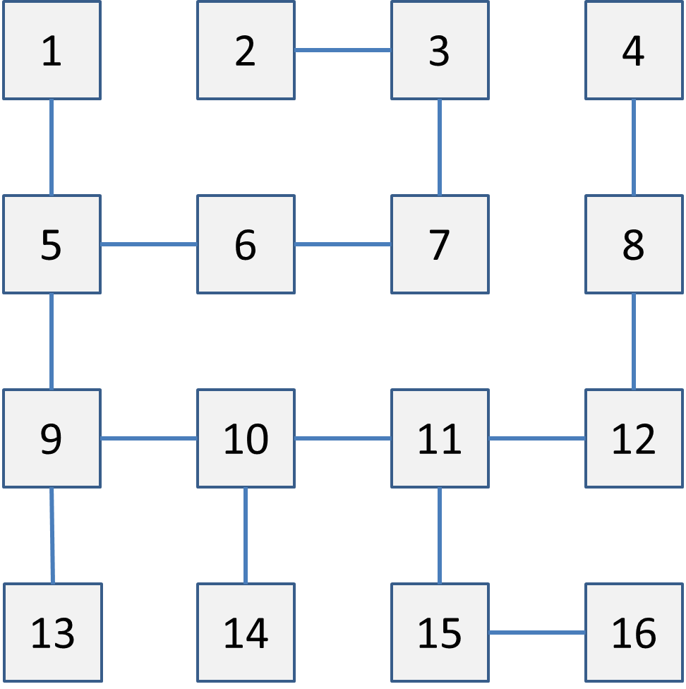

Een voorbeeld van een recursieve definitie is de definitie van de
faculteit, die ik al heb geïntroduceerd in twee eerdere hoofdstukken. In
die hoofdstukken gaf ik de volgende definitie van de faculteit: de
faculteit van een positief geheel getal is dat getal, vermenigvuldigd
met alle positieve gehele getallen die kleiner zijn (exclusief nul).

Wiskundigen prefereren een recursieve definitie: De faculteit $$n!$$ van
een positief getal $$n$$ wordt als volgt berekend: $$1! = 1$$, en
$$n! = n * (n-1)!$$ voor $$n > 1$$.

Deze definitie is recursief omdat het refereert aan de faculteit van
$$n-1$$ om de faculteit van $$n$$ te definiëren. Dit leidt niet tot
eindeloze recursie, omdat op enig moment $$n$$ gelijk zal zijn aan $$1$$, en
de faculteit van $$1$$ is apart gedefinieerd.

Je kunt de faculteit als een recursieve functie als volgt implementeren:

```python
def faculteit( n ):
    if n <= 1:
        return 1
    return n * faculteit( n-1 )

print( faculteit( 5 ) )
```

Zie hoe deze functie exact de recursieve definitie van de faculteit
volgt: als `n` gelijk is aan 1, retourneert de functie 1, en anders
retourneert het `n` keer de faculteit van `n-1`. (Merk op dat ik
`n <= 1` schreef in plaats van `n == 1` om te voorkomen dat er problemen
ontstaan als de gebruiker de functie aanroept met, bijvoorbeeld, een
negatieve `n`.)

Voor het geval je het problematisch vindt om te begrijpen wat deze
functie doet, beschrijf ik hieronder de aanroepen die de functie doet
als hij wordt aangeroepen met 5 als argument. Ik laat aanroepen
inspringen als een "hoger-niveau aanroep" nog steeds actief is als de
aanroep wordt gemaakt. Een "return" die één inspringing dieper gaat dan
een "aanroep," wordt gegeven in die aanroep, en retourneert de gegeven
waarde.

```python
aanroep faculteit( 5 )
    aanroep faculteit( 4 )
        aanroep faculteit( 3 )
            aanroep faculteit( 2 )
                aanroep faculteit( 1 )
                    return 1
                return 2 * 1
            return 3 * 2
        return 4 * 6
    return 5 * 24
print( 120 )
```

### Wanneer gebruik je recursie

Als je doorhebt hoe de recursieve implementatie van de faculteit werkt,
ziet het er wellicht aantrekkelijk uit. Het is eenvoudig, elegant, en is
eigenlijk best wel "cool." Echter, de iteratieve implementatie van de
faculteit is zeer te prefereren boven de recursieve.

De reden blijkt uit de beschrijving van de aanroepen hierboven. Je ziet
dat voordat de aanroep `faculteit( 1 )` wordt gemaakt, er al vier
aanroepen van `faculteit()` in het geheugen van de computer staan. Als
je de faculteit van 100 zou willen berekenen, komen er niet minder dan
100 aanroepen van faculteit in het geheugen te staan alvorens er waardes
geretourneerd gaan worden. Dit is geen goed idee, en Python zou gebrek
aan (stack) geheugen kunnen krijgen, of heel, heel erg traag worden.

Daartegenover staat dat een iteratieve implementatie van de faculteit
slechts twee variabelen in het geheugen hoeft te houden. Dat is snel en
geeft geen gevaar dat de computer vastloopt. Je moet alleen recursieve
implementaties bouwen als:

-   recursie de meest natuurlijke manier is om de oplossing te
    implementeren; en

-   het recursieve proces gegarandeerd niet te diep gaat.

Iedere recursieve functie kan ook als een iteratief proces gebouwd
worden. Zo nu en dan kom je echter een probleem tegen waarvoor de
recursieve oplossing veel eleganter, leesbaarder, en onderhoudbaarder is
dan de iteratieve variant. In dat geval moet je overwegen een recursieve
oplossing te implementeren.

### Doolhof doorzoeken

Op dit punt in het boek is het lastig een goede demonstratie van
recursie te geven, aangezien het specifieke data structuren[^11] nodig
heeft om de kracht te tonen. Om toch iets niet-triviaals te tonen, heb
ik een module genaamd `pcmaze` gecreëerd. Je vindt deze module in
appendix
<a href="#ch:pcmaze" data-reference-type="ref" data-reference="ch:pcmaze">32</a>,
en je moet hem ofwel zelf maken, ofwel downloaden van dezelfde site waar
je `pcinput.py` hebt gevonden, om de code van deze paragraaf te kunnen
uitvoeren.

`pcmaze` implementeert een eenvoudig doolhof, dat een aantal genummerde
cellen met elkaar verbindt. De ingang van het doolhof kun je vinden door
aanroep van de functie `entrance()`.[^12] De uitgang van het doolhof
wordt gegeven door de functie `exit()` (niet te verwarren met de
`exit()` functie uit de `sys` module). De module heeft ook een functie
`connected()` die twee numerieke argumenten krijgt: deze retourneert
`True` als er een directe verbinding bestaat tussen de cellen met die
nummers, en anders `False`. De ingang is gegarandeerd de
laagst-genummerde cel, en de uitgang is gegarandeerd de
hoogst-genummerde cel.

Het doel is code te schrijven die een pad uitzet van de ingang naar de
uitgang (als een dergelijk pad bestaat). Het doolhof is gevisualiseerd
in afbeelding
<a href="#f:maze" data-reference-type="ref" data-reference="f:maze">10.1</a>.
De ingang is 1, de uitgang is 16.

{:width="40%" data-caption="Het doolhof van `pcmaze`."}

Hoe vind je nu je weg door zo'n doolhof (zonder dat je de layout kent)?
Recursief kan dat als volgt: Je definieert een functie
`leidt_naar_uitgang()` die een pad naar de uitgang retourneert als de
cel die als parameter wordt meegegeven op het pad ligt dat naar de
uitgang leidt. Als die functie een pad retourneert, dan weet je dat de
huidige cel op dat pad ligt. Als je hem dus aanroept met cel 1, krijg je
een pad dat leidt van de ingang naar de uitgang (als dat pad er is).

Maar hoe weet de functie of een cel ligt op het pad dat leidt naar de
uitgang? Als de huidige cel de uitgang zelf is, dan weet je dat,
jazeker, deze cel op dat pad ligt. Zo niet, dan ligt de cel op het pad
dat leidt naar de uitgang als het een verbinding heeft met een cel die
ligt op het pad dat leidt naar de uitgang. Dit is een recursieve
definitie.

Je moet voorzichtig zijn met zo'n recursieve definitie dat je niet
vastloopt op een circulair pad in het doolhof. Dat betekent dat als de
functie "beweegt" van cel A naar cel B, de functie niet meer terug mag
komen bij A. Als dat gegarandeerd is, moet de functie werken. De
eenvoudige implementatie die ik hier ga geven zou niet werken als er
circulaire paden in het doolhof zouden zijn, maar die zijn er gelukkig
niet. Het probleem is niet onoplosbaar als ze er wel zijn, maar om dat
netjes op te lossen heb je een data structuur nodig die pas in een
toekomstig hoofdstuk aan bod komt.

In pseudo-code ziet de recursieve functie `leidt_naar_uitgang()` er
ongeveer als volgt uit:

```python
functie leidt_naar_uitgang( huidigecel ):
    if (huidigecel is de uitgang):
        return (pad dat alleen de uitgang bevat)
    for (iedere verbondencel die nog niet onderzocht is):
        pad = leidt_naar_uitgang( verbondencel )
        if (pad is niet leeg):
            voeg huidigecel toe aan pad
            return pad
    return (leeg pad)
```

Ik geef nu een implementatie van deze recursieve oplossing. In de
implementatie meteen hieronder geef ik niet het pad terug, maar ik
retourneer gewoon `True` of `False` om aan te geven of het pad gevonden
is, en ik print het pad in de functie zelf (ik zal later in dit
hoofdstuk een complete implementatie van de pseudo-code geven).

```python
from pcmaze import entrance, exit, connected

def leidt_naar_uitgang( komtvan, cel ):
    if cel == exit():
        return True
    for i in range( entrance(), exit()+1 ):
        if i == komtvan:
            continue
        if not connected( cel, i ):
            continue
        if leidt_naar_uitgang( cel, i ):
            print( cel, "->", i )
            return True
    return False

if leidt_naar_uitgang( 0, entrance() ):
    print( "Pad gevonden!" )
else:
    print( "Pad niet gevonden" )
```

Ik bespreek deze recursieve functie nu in detail.

De functie krijgt twee parameters. De eerste is de cel waar het pad
vandaan komt. De tweede is de cel die gecontroleerd wordt om te zien of
hij naar de uitgang leidt. De eerste parameter is alleen nodig omdat je
niet mag terugkeren op het pad.

De functie controleert eerst of de uitgang bereikt is. Zo ja, dan
retourneert de functie `True`.

Als de uitgang niet bereikt is, controleert de functie alle cellen van
het doolhof om te zien of ze verbonden zijn met de huidige cel.

De cel waarvandaan de aanroep gekomen is wordt uitgesloten. Ook worden
alle cellen uitgesloten waarmee geen verbinding is. Maar alle overige
cellen worden gecontroleerd. De cel zelf hoeft niet uitgesloten te
worden, aangezien in de definitie van het doolhof een cel nooit
verbonden is met zichzelf.

Als een cel blijkt naar de uitgang te leiden (doordat de recursieve
aanroep `True` geeft), dan drukt de functie af dat de beweging "huidige
cel naar gecontroleerde cel" deel is van het pad dat naar de uitgang
leidt. Vervolgens retourneert de functie `True`.

Anders, nadat alle verbonden cellen zijn gecontroleerd en nog steeds
geen pad is gevonden, retourneert de functie `False`.

Deze aanpak zal het volledige pad van ingang naar uitgang afdrukken, in
omgekeerde volgorde.

Om duidelijk te maken wat er precies gebeurt in de functie, heb ik hem
wat uitgebreid. De implementatie hieronder drukt iedere verbinding die
gecontroleerd wordt af. Ik heb ook een parameter `diepte` toegevoegd,
die bijhoudt hoe diep de recursie gaat. Ik vertaal die diepte in
inspringingen.

```python
from pcmaze import entrance, exit, connected

def leidt_naar_uitgang( komtvan, cel, diepte ):
    inspringing = diepte * 4 * " "
    if cel == exit():
        return True
    for i in range( entrance(), exit()+1 ):
        if i == komtvan:
            continue
        if not connected( cel, i ):
            continue
        print( inspringing + "Controleer", cel, "->", i )
        if leidt_naar_uitgang( cel, i, diepte + 1 ):
            print( inspringing + "Pad gevonden:", cel, "->", i )
            return True
    return False

if leidt_naar_uitgang( 0, entrance(), 0 ):
    print( "Pad gevonden!" )
else:
    print( "Pad niet gevonden" )
```

### Retourwaardes van recursieve functies

Net als reguliere functies, kunnen recursieve functie informatie
communiceren aan de rest van het programma middels retourwaardes.

Een van de minder-fraaie zaken van de doolhof-oplossende functie
hierboven is dat het pad geprint wordt in plaats van geretourneerd – wat
er ook toe leidt dat het pad in omgekeerde volgorde wordt afgedrukt. Het
zou beter zijn als de functie aanroepen hun deel van het pad aan een
hoger liggende aanroep zouden retourneren, zodat uiteindelijk het pad
als geheel zou worden geretourneerd naar de eerste aanroep. Dit is wat
de pseudo-code beoogde. Een goede manier om een pad te retourneren is in
de vorm van een list, maar dat is het onderwerp van hoofdstuk
<a href="#ch:lists" data-reference-type="ref" data-reference="ch:lists">13</a>.
In plaats daarvan doe ik het als een string.

Het werkt als volgt: een aanroep die de uitgang vindt, retourneert het
nummer van de uitgang als string. Een aanroep die een deel van het pad
geretourneerd krijgt, retourneert dat pad zelf ook weer, maar voegt de
huidige cel toe aan het pad. Een aanroep die een lege string
terugkrijgt, retourneert zelf ook een lege string.

Dit betekent dat in de code hierboven, iedere `return True` vervangen
moet worden door een commando dat een string retourneert dat een (deel
van het) pad retourneert, en iedere `return False` vervangen moet worden
door het retourneren van een lege string. De code wordt dan:

```python
from pcmaze import entrance, exit, connected

def leidt_naar_uitgang( komtvan, cel ):
    if cel == exit():
        return "{}".format( exit() )
    for i in range( entrance(), exit()+1 ):
        if i == komtvan:
            continue
        if not connected( cel, i ):
            continue
        check = leidt_naar_uitgang( cel, i )
        if check != "":
            return "{} -> {}".format( cel, check )
    return ""

check = leidt_naar_uitgang( 0, entrance() )
if check != "":
    print( "Pad gevonden!", check )
else:
    print( "Pad niet gevonden" )
```

Als je recursie wilt begrijpen, moet je deze code goed bestuderen. De
code is een typische weergave van het gebruik van retourwaardes in
recursieve functies. Studenten wiens begrip van recursie wankel is en
die een opdracht krijgen waar informatie van een dieper niveau van
recursie naar een hoger niveau van recursie gecommuniceerd moet worden,
grijpen vaak naar een globale variabele om dit te doen. Je ziet dat dat
niet nodig is.

Feitelijk is er geen echt verschil tussen een recursieve functie aanroep
en een reguliere functie aanroep, behalve dat je bij recursieve
aanroepen ervoor moet zorgen dat ze wel op een bepaald moment eindigen.
Recursie ziet er alleen vreemd uit de eerste keer dat je het tegenkomt.

[^11]: Een data structuur is een manier om een bepaalde soort data in
    het geheugen van de computer op te slaan. Een integer, bijvoorbeeld,
    is een simpele data structuur die precies één geheel getal in het
    geheugen vasthoudt. Er bestaan complexere data structuren, die
    bijvoorbeeld een rij getallen vasthouden. Deze komen in latere
    hoofdstukken aan bod.

[^12]: Ik heb Engelstalige functiebenamingen gekozen om ervoor te zorgen
    dat de code compatibel is met de Engelstalige versie van dit boek.
