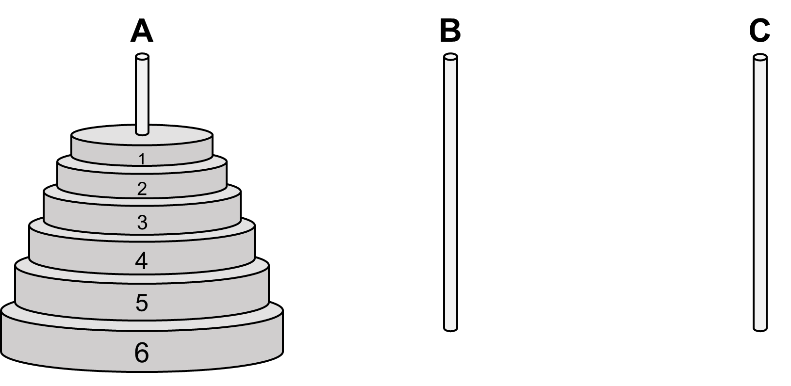

The Towers of Hanoi is a puzzle, which uses
three poles, labeled A, B, and C. On pole A there is a stack of discs of
varying size; the discs are numbered according to their size. The
smallest disc is 1, the next one is 2, the next one is 3, etcetera, up
to size $$n$$. Typical values for $$n$$ are 4 and 5, though in the classic
puzzle $$n$$ is supposed to be 64. The discs are stacked on pole A
according to their size, the smallest one on top, and the biggest one on
the bottom. You now have to move all the discs from pole A to pole C,
whereby you have to follow these four rules:
 
1. you can only move one disc at a time;

2. you can only move discs between the poles;

3. you can only move a disc from a pole if it is on top, and can only move it to the top of another pole;

4. you can never place a disc on top of a disc that is smaller.

### Assignment

Write a function `hanoi` that solves this puzzle for any
value of $$n$$. The function must print the solution as a recipe, with lines such as 

> `Move disc 1 from pole A to pole C.` 

At the end, print the
number of moves you needed to make, preferably calculated during the
process of generating the recipe.

{:class="callout callout-info"}
> #### Tip
> To think about a recursive solution, consider the following: Solving the
> Towers of Hanoi with a biggest disc of size 10 is easy if you know how
> to solve it for size 9. Namely, you use your size-9 procedure to move
> the top 9 discs to the middle pole, then move the disc of size 10 to the
> target pole, and finally use the size-9 procedure to move the 9 discs
> from the middle pole to the target pole. But how do you solve the
> problem with the biggest disc being size 9? Well, that is simple if you
> know how to solve it for size 8… You can imagine where this is going.
> You are reducing the complexity of the problem step by step, until you
> are at "solving the problem for size 2 is simple if you can solve it for
> size 1." Solving it for size 1 is trivial: you just move the disc to
> where it must go. Basically, this comes down to a recursive definition
> of the solution method:
> 
> To solve it for size $$n$$ where you move from pole X to pole Y with Z as
> temporary pole, you first solve it for size $$n - 1$$ where you move from
> pole X to pole Z with pole Y as temporary pole, then move the disc of
> size $$n$$ from pole X to pole Y, and finally solve the problem for size
> $$n - 1$$ where you move from pole Z to pole Y with pole X as temporary
> pole.  
>
> {:width="70%"}

### Example

```console?lang=python&prompt=>>>
>>> hanoi(4)
Disc 1 from A to B
Disc 2 from A to C
Disc 1 from B to C
Disc 3 from A to B
Disc 1 from C to A
Disc 2 from C to B
Disc 1 from A to B
Disc 4 from A to C
Disc 1 from B to C
Disc 2 from B to A
Disc 1 from C to A
Disc 3 from B to C
Disc 1 from A to B
Disc 2 from A to C
Disc 1 from B to C
15 moves needed
```
