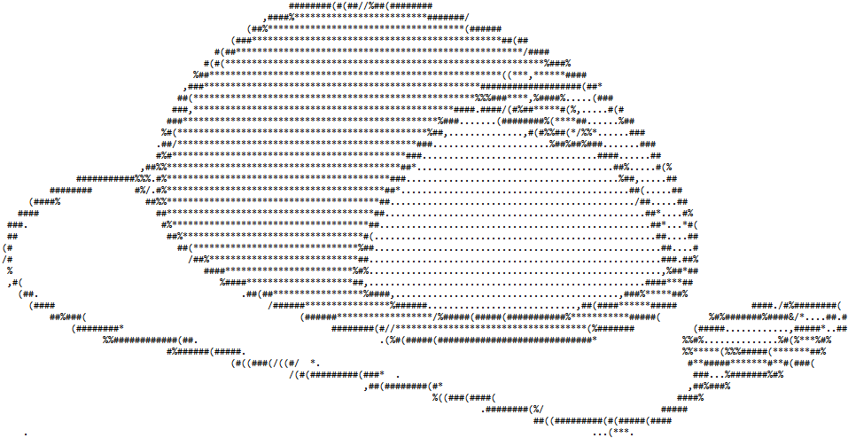

When programmers refer to "text files" or "flat text files," they mean
files in which all characters are meant to be read as regular
characters, like you would type on a keyboard. For instance, Python
program files are flat text files, as are HTML files. Word processor
documents, however, are not flat text files, and neither are images. If
you want to know whether a file is a text file or not, you can try to
open it in a text editor (such as the editor for the IDLE environment,
which comes with Python). If you see only readable text, the file is
likely to be a text file. Otherwise, it is a so-called "binary file"
(binary files are discussed in Chapter
<a href="#ch:binaryfiles" data-reference-type="ref" data-reference="ch:binaryfiles">19</a>).

Text files consist of lines of text. At the end of a line, there is a
"newline" symbol, which in Python is the character `"\n"`. Different
operating systems use slightly different ways of storing this character
in a text file: some Windows programs store it as "carriage return plus
line feed" (`"\r\n"`), while on Linux it is always stored as a single
`"\n"`. As long as you access a file from Python as a regular text file,
Python will convert the characters that it reads to the standard `"\n"`,
and vice versa when it writes. So you do not need to worry about such
differences (except when you need to transfer text files between
operating systems).

{:width="80%"}

### File handles and pointers

When you work with a file in a program, you have to open the file.
Opening a file provides a so-called "file handle." A file handle can be
seen as an access point to the file. It contains a "pointer" that
indicates a particular place in the file. That pointer is used when you
read from or write to the file. For instance, when you read from the
file, it starts reading at the pointer, and moves the pointer forward in
the file.

When you open a file, the pointer is placed at a particular spot in the
file, depending on how you opened the file. If you opened the file for
reading only, the pointer is placed at the start of the file. The same
is true when you open the file for both reading and writing. If you open
the file for "appending" (i.e., to place new data at the file's end),
the file pointer is positioned at the end of the file. Lastly, if you
open a file for writing only, actually the file is completely emptied
and the file pointer is placed at the start of the, now empty, file. To
create a new file (i.e., a file with a name that does not exist yet),
you open it for "writing only."

After opening the file, the file handle is the only access point for the
file. All actions you perform on the file, you perform as methods for
the file handle.

Note that any operating system only allows a limited number of files to
be open simultaneously. Therefore you should close files that you no
longer need to work with.

### Moving the file pointer

The file pointer, that indicates where in a file you are working, is
moved automatically. For instance, when you read 10 characters from a
file, the file pointer indicates which is the first of those 10
characters, and, while reading, moves up 10 characters, so that its new
position is 10 characters further in the file than before. When you deal
with text files, the automatic movements of the file pointer are exactly
what you want. You can position the file pointer manually using specific
methods, but such methods are, in general, only used when dealing with
binary files. Therefore, in this chapter I will ignore these methods,
but they will be discussed in the chapter on binary files.

### Buffering

When you make changes to files, these often are not stored in the files
immediately. Instead, the operating system "buffers" the changes in
memory, and "flushes" the buffers to the actual files when it sees a
need for that. You can force the flushing of the buffers by closing a
file. Buffers are also flushed when your program ends normally.

However, when your program crashes (for instance because of a runtime
error), buffers might not be flushed, and your files will not be updated
to the point where the crash took place. So you cannot take the file
contents into account when trying to debug a program.

### File processing programs

Most programs that deal with text files follow a process that, in a
loop, reads contents of a file, processes those contents in some way,
then writes the contents to another file. For instance, a program might
read lines from a text file, and for each line sort the words, then
write the sorted words to another text file. This is hardly any
different from a program that asks the user the provide, in a loop, a
line of text, then sorts the words in the line, and displays them using
the `print()` function. While students tend to find it easy to write the
version of the program that gets user input and displays output, my
experience has taught me that many students find it very hard to use
file input and output for the same purpose.

I never found out why exactly students think it is so much harder to do
it with files, though I can imagine that you feel you have little
control over your own program when working with files. When you provide
input to a program manually, and see it displaying outputs, you always
know more or less what lines of your code Python is processing, and you
can make up tests on the fly. If you work with files, you have to
prepare your files beforehand, then run the program and wait until it
finishes before you can examine the contents of the output files.

While working with files might give a sense of lack of control, during
development of the program you can always include `print()` statements
to get an insight in what the program is doing. For instance, when it
reads a line, you can print that line, and when it writes a line, you
can also print that line. That way, your insight in the inner workings
of the program is no different regardless whether you use manual inputs
and screen outputs, or file inputs and outputs.
