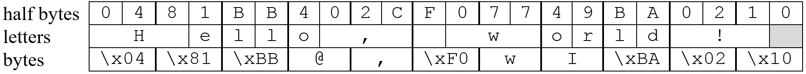

De veertien meest gebruikte letters
in de Engelse taal zijn: `etaoinshrdlcum` (in het Nederlands zijn het de
letters `etanirodslgvhk`). Schrijf een tekst compressie programma dat op
dit feit gebaseerd is. Het programma slaat de genoemde letters op in
halve bytes. Een halve byte kan de getallen 0 tot en met 15 bevatten.
Als je alleen de getallen 1 tot en met 15 gebruikt, kan ieder van deze
getallen één van de genoemde letters representeren, en kun je de 15
gebruiken voor de spatie. Je kunt dan dus twee van deze letters (of
spatie) opslaan in één byte (de waarde van die byte zou dan 16 keer de
waarde van de eerste letter plus de waarde van de tweede letter zijn).
Als je in de tekst een letter of teken aantreft dat niet bij deze
vijftien hoort, dan geef je dat aan door halve byte met waarde 0 op te
slaan, gevolgd door de hele byte die het niet-geëncrypte teken bevat. In
deze opzet is het mogelijk dat de hele byte verdeeld wordt over halve
bytes van twee opeenvolgende bytes, namelijk de tweede helft van de ene
byte, en de eerst helft van de tweede byte. Je mag zelf kiezen of je het
programma schrijft met de Nederlandse of de Engelse letters (het
verschil in het programma is maar één regel), maar in de rest van deze
beschrijving en in mijn oplossing gebruik ik de Engelse letters.

Hint: een eenvoudige manier om dit probleem aan te pakken is het bouwen
van een list van "half-bytes." Voor de tekens die het meest voorkomen,
gebruik je de index-waarde van de string `"etaoinshrdlcum "` plus 1 (dat
geeft een waarde tussen 1 en 15; merk op dat het laatste teken van de
string de spatie is). Voor de andere tekens sla je drie half-bytes op,
namelijk nul, gevolgde door de waarde van de byte gedeeld door 16 (naar
beneden afgerond), gevolgd door de waarde van de byte modulo 16. Als de
half-byte-list klaar is, maak je er een byte list van door steeds paren
half-bytes te nemen, en de eerste met 16 te vermenigvuldigen en de
tweede erbij optellen. Die list kun je dan naar een byte string omzetten
via een `bytes()` cast.

Om dit te testen: de string `"Hello, world\`"!, die 13 tekens lang is,
wordt, als je de hierboven beschreven procedure volgt (die van de `e`
een 1 maakt, van de `t` een 2, etcetera), een byte string met 11 tekens:
`b'\\x04\\x81\\xbb@,\\xf0wI\\xba\\x02\\x10'`.

Om deze vertaling van `"Hello, world\`"! naar de gegeven byte string
iets beter uit te leggen (zie afbeelding
<a href="#f:compression" data-reference-type="ref" data-reference="f:compression">19.1</a>):
Je herinnert je wellicht dat een hexadecimale representatie van een byte
bestaat uit twee hexadecimale cijfers, dat wil zeggen, ieder cijfer past
in een half-byte. Met die informatie kun je begrijpen hoe de vertaling
gedaan is. De eerste byte van de vertaling is `\x04`, dus de eerste
half-byte is nul. Dat betekent dat het eerste teken van de originele
string letterlijk is opgeslagen, dus bestaat uit de tweede half-byte van
`\x04`, en de eerste half-byte van de volgende byte, die `\x81` is. Dat
is de byte `\x48`. Als je de hexadecimale code 48 opzoekt in de ASCII
tabel (die je vindt in hoofdstuk
<a href="#ch:strings" data-reference-type="ref" data-reference="ch:strings">11</a>),
zie je dat het de letter `H` representeert. De volgende half-byte is de
tweede half-byte van `\x81`, dus 1. Omdat dit geen nul is, is het een
van de veel voorkomende tekens, namelijk de eerste, de letter `e`. Zo
zie je dus hoe `"Hello, world\`"! gecomprimeerd wordt als de gegeven
byte string. In de byte string zie je een paar tekens die niet als hun
hexadecimale code zijn weergegeven; als je wilt weten wat hun
hexadecimale code is, kun je die opzoeken in de ASCII tabel.

Ondanks de lange beschrijving, kan dit programma geschreven worden in
minder dan 30 regels code, inclusief commentaar, lege regels, en tests.

{:width="65%" data-caption="Voorbeeld van compressie."}