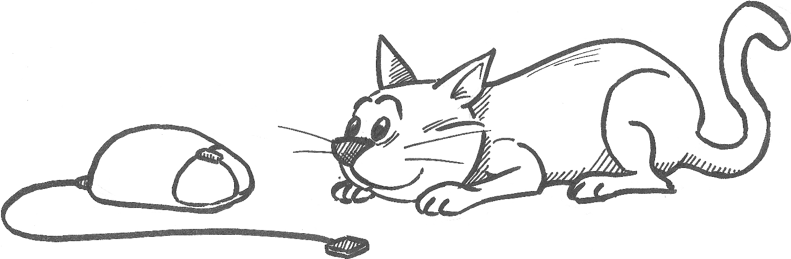

If you made it through the book and managed to do most of the exercises
all by yourself: Congratulations! You have become a programmer. You have
internalized the basics of dealing with any programming language, and
should be able to solve most of the programming problems that you
encounter in your career as a student or as a professional worker. If
you need to learn another programming language, by now you have a solid
basis to quickly get to grips with any other language. Even better, you
have learned to approach problems like programmers do, which is a
valuable skill that you will find many uses for.

Future editions of this book should have even more information and more
interesting problems to work on. This will all be optional material, but
if you enjoy programming as much as I do, you might want to check it
out.

If you have any remarks on the contents of the present version of the
book, I'll be glad to receive your message at
<pythonbook@spronck.net>.

{:width="80%"}
